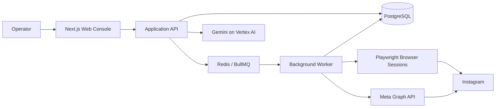

<div align="center">


<br />

# Instara Crew

### A self-hosted Instagram workflow console for multi-account operations, AI-assisted content preparation and controlled job execution.

Built around **Next.js**, **Playwright**, **Gemini**, **PostgreSQL**, **Redis** and **BullMQ** — with a strong focus on visibility, session isolation, dry-run workflows and operator control.

<br />

[](LICENSE)
[](https://nextjs.org/)
[](https://www.typescriptlang.org/)
[](https://playwright.dev/)
[](https://cloud.google.com/vertex-ai)

<br />

[Overview](#overview) · [Features](#features) · [Architecture](#architecture) · [Quick Start](#quick-start) · [Configuration](#configuration) · [Testing](#testing) · [Project Status](#project-status)

</div>

---

## Overview

**Instara Crew** is an experimental, self-hosted operations console designed to manage Instagram-oriented workflows from one place.

The project combines:

- a web dashboard for accounts, jobs and execution status;
- persistent browser sessions managed through Playwright;
- optional per-account proxy configuration;
- an official Meta Graph API integration path for supported account types and actions;
- Gemini-powered multimodal analysis and comment generation;
- PostgreSQL persistence through Prisma;
- Redis + BullMQ workers for queued background execution;
- operator guardrails such as dry-run, account limits, pause/cancel controls and execution logs.

The goal is not to hide what the system is doing. The goal is to make every operation **observable, configurable and reversible from a single console**.

> [!IMPORTANT]
> Instara Crew is under active development. Browser-based integrations with third-party platforms can change or break without notice. No automation method can guarantee account safety, uninterrupted operation or immunity from platform restrictions.

---

## Features

### Multi-account workspace

Manage multiple profiles from one dashboard while keeping account-specific state separated.

- persistent browser profile per account;
- account labels and status tracking;
- optional proxy assignment per profile;
- configurable mobile/device profile;
- login-required and paused states;
- last-activity tracking.

### Dual integration model

Instara Crew supports two different execution paths depending on the account and workflow.

| Mode | Best suited for | Authentication | Notes |
|---|---|---|---|
| **Meta Graph API** | Supported Creator / Business workflows | OAuth 2.0 | Uses official Meta endpoints and platform permissions |
| **Browser Session** | Interactive browser workflows | Persistent local session | Uses Playwright with isolated account profiles |

The two modes are intentionally separated: an official API workflow and browser automation do not have the same capabilities, constraints or operational characteristics.

### Gemini-assisted comment preparation

Gemini can analyze visual content and generate context-aware text before a job is executed.

- multimodal image/context analysis;
- selectable tone and additional context;
- batch generation;
- unique comment storage at database level;
- configurable Gemini model through environment variables;
- Google Vertex AI authentication through Application Default Credentials — no hard-coded Gemini API key required.

### Job orchestration

Jobs are persisted and processed by background workers instead of being tied to a browser request.

- preparation and publication queues;
- per-item execution state;
- assignment across active accounts;
- retry/error visibility;
- pause and cancel controls;
- detailed job logs;
- Redis-backed BullMQ processing.

### Operational guardrails

Automation should remain under explicit operator control.

- **Dry Run enabled by default**;
- configurable hourly and daily account limits;
- minimum gap between actions;
- configurable active hours;
- per-run account limits;
- automatic account pause when a blocking condition is detected;
- human-readable execution logs.

---

## Architecture



### Core stack

| Layer | Technology | Responsibility |
|---|---|---|
| Web application | **Next.js 16 + React 19** | Dashboard, API routes and operator controls |
| Language | **TypeScript** | Strictly typed application code |
| Browser runtime | **Playwright** | Persistent browser sessions and device emulation |
| AI | **Google Gemini / Vertex AI** | Multimodal analysis and text generation |
| Database | **PostgreSQL + Prisma** | Accounts, jobs, items and logs |
| Queue | **BullMQ + Redis** | Background preparation and execution |
| Validation | **Zod** | Runtime request/config validation |

---

## Project Structure

```text
Instara-Crew/
├── docs/
│   └── assets/              # README artwork and project branding
├── prisma/
│   └── schema.prisma        # Database models
├── public/                  # Application logos and static assets
├── scripts/                 # Self-tests, guardrails and asset utilities
├── src/
│   ├── app/                 # Next.js UI and API routes
│   ├── lib/                 # Browser, Gemini, Meta, queue and security modules
│   └── worker.ts            # BullMQ background worker
├── .env.example             # Environment template
├── docker-compose.yml       # PostgreSQL + Redis services
├── package.json
└── README.md
```

---

## Quick Start

### Requirements

Before starting, install:

- **Node.js 20+**
- **npm**
- **Docker Desktop** or Docker Engine with Compose
- **Google Cloud CLI** if you want to use Gemini through Vertex AI

### 1. Clone the repository

```bash
git clone https://github.com/LUC4N3X/Instara-Crew.git
cd Instara-Crew
```

### 2. Install dependencies

```bash
npm install
npx playwright install chromium
```

### 3. Start PostgreSQL and Redis

```bash
docker compose up -d
```

### 4. Create your local environment file

**Windows PowerShell**

```powershell
Copy-Item .env.example .env
```

**Linux / macOS**

```bash
cp .env.example .env
```

### 5. Generate the session encryption key

Instara Crew encrypts sensitive stored token material. Generate a 256-bit key and place it in `SESSION_ENCRYPTION_KEY_BASE64`.

**PowerShell**

```powershell
$key = New-Object byte[] 32
[Security.Cryptography.RandomNumberGenerator]::Fill($key)
[Convert]::ToBase64String($key)
```

> [!CAUTION]
> Never commit your real `.env`, access tokens, credentials, browser profiles or encryption key to Git.

### 6. Configure Gemini on Vertex AI

Authenticate locally:

```bash
gcloud auth login
gcloud auth application-default login
gcloud config set project YOUR_PROJECT_ID
gcloud services enable aiplatform.googleapis.com
```

Then set at least:

```env
GOOGLE_CLOUD_PROJECT=your-project-id
GOOGLE_CLOUD_LOCATION=global
GEMINI_MODEL=gemini-2.5-flash
```

### 7. Prepare the database

```bash
npm run prisma:generate
npm run prisma:migrate
```

### 8. Start Instara Crew

```bash
npm run dev:all
```

Open:

```text
http://localhost:3000
```

---

## Configuration

The repository includes a documented `.env.example` with sensible development defaults.

### Core services

| Variable | Purpose |
|---|---|
| `DATABASE_URL` | PostgreSQL connection string |
| `REDIS_URL` | Redis connection string |
| `SESSION_ENCRYPTION_KEY_BASE64` | 256-bit key used for encrypted sensitive data |

### Meta integration

| Variable | Purpose |
|---|---|
| `META_APP_ID` | Meta application ID |
| `META_APP_SECRET` | Meta application secret |
| `META_REDIRECT_URI` | OAuth callback URL |

### Gemini / Vertex AI

| Variable | Purpose |
|---|---|
| `GOOGLE_CLOUD_PROJECT` | Google Cloud project ID |
| `GOOGLE_CLOUD_LOCATION` | Vertex AI region/location |
| `GEMINI_MODEL` | Gemini model used by the composer |

### Browser sessions

| Variable | Purpose |
|---|---|
| `BROWSER_PROFILE_ROOT` | Directory containing persistent account profiles |
| `BROWSER_HEADLESS` | Run browser sessions with or without visible UI |
| `BROWSER_TIMEZONE` | Default browser timezone |
| `BROWSER_CHANNEL` | Optional installed browser channel |

### Execution controls

| Variable | Purpose |
|---|---|
| `DRY_RUN` | Prepare/type actions without final submission |
| `RATE_LIMITS` | Enable or disable configured operational limits |
| `POST_ACCOUNT_CONCURRENCY` | Number of account workers allowed in parallel |
| `ACCOUNT_MAX_PER_HOUR` | Per-account hourly action limit |
| `ACCOUNT_MAX_PER_DAY` | Per-account daily action limit |
| `ACCOUNT_MIN_GAP_SEC` | Minimum time between actions for one account |
| `ACTIVE_HOUR_FROM` / `ACTIVE_HOUR_TO` | Allowed local execution window |

For the complete list and defaults, see [`.env.example`](.env.example).

---

## Available Commands

| Command | Description |
|---|---|
| `npm run dev` | Start the Next.js development server |
| `npm run worker` | Start the BullMQ worker |
| `npm run dev:all` | Run web application and worker together |
| `npm run build` | Create a production Next.js build |
| `npm run start` | Start the production web server |
| `npm run prisma:generate` | Generate the Prisma client |
| `npm run prisma:migrate` | Run development database migrations |
| `npm run prisma:studio` | Open Prisma Studio |
| `npm run typecheck` | Run TypeScript validation |
| `npm run test:guardrails` | Run operational guardrail checks |
| `npm run test:selftest` | Run project self-tests |
| `npm test` | Run the complete verification chain |

---

## Testing

Run the full verification suite with:

```bash
npm test
```

The test chain currently includes:

1. TypeScript type checking;
2. guardrail verification;
3. project self-tests for core runtime behavior.

For a faster static check:

```bash
npm run typecheck
```

---

## Security Notes

- Keep `.env` out of version control.
- Treat browser profile folders as sensitive local data.
- Do not share OAuth tokens, cookies, proxy credentials or encryption keys.
- Use separate development credentials when testing integrations.
- Keep `DRY_RUN=true` until you have verified the target workflow and account configuration.
- Review third-party platform requirements before enabling any real external action.

No browser automation layer should be described as undetectable, ban-proof or risk-free. Platform behavior, policies and detection systems evolve independently from this project.

---

## Project Status

> **Experimental / active development**

Instara Crew is currently a young project (`0.1.x`). APIs, selectors, database models and workflow behavior may evolve quickly while the architecture is being refined.

If you are testing the project, prefer:

- local development environments;
- accounts and data you are authorized to use;
- dry-run execution first;
- conservative operational limits;
- explicit verification before enabling real actions.

---

## Responsible Use & Disclaimer

Instara Crew is an independent open-source project and is **not affiliated with, endorsed by, sponsored by or maintained by Meta Platforms, Inc. or Instagram**.

Instagram and Meta names and trademarks belong to their respective owners.

You are responsible for ensuring that your use of this software complies with applicable laws, account permissions, platform rules and third-party terms. The maintainers make no guarantee that a particular workflow will remain available or permitted by an external platform.

The software is provided **as is**, without warranty of any kind. See the project license for the complete terms.

---

## Author

Created and maintained by **[LUC4N3X](https://github.com/LUC4N3X)**.

If Instara Crew is useful to you, consider starring the repository — it helps the project get discovered and makes future development easier to follow.

---

## License

Instara Crew is released under the **GNU General Public License v3.0 or later**.

See [`LICENSE`](LICENSE) for the full license text.

<div align="center">

<br />

**Instara Crew** · Built for controlled, observable and self-hosted workflow experimentation.

</div>
