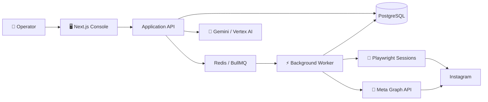

<div align="center">


<br />

# ✦ Instara Crew

> [!WARNING]
> 🚧 **ACTIVE DEVELOPMENT — EXPERIMENTAL SOFTWARE**  
> Instara Crew is currently under active development. Features, APIs, selectors, integrations and runtime behavior may change, break or be removed without notice. **Do not treat the current version as production-ready.**

### A self-hosted Instagram workflow console for multi-account operations, AI-assisted content preparation and controlled job execution.

Built with **Next.js**, **Playwright**, **Gemini**, **PostgreSQL**, **Redis** and **BullMQ** — designed around visibility, isolated sessions, dry-run workflows and explicit operator control.

<br />

[](LICENSE)
[](#-development-status)
[](https://nextjs.org/)
[](https://www.typescriptlang.org/)
[](https://playwright.dev/)
[](https://cloud.google.com/vertex-ai)

<br />

[🌐 Overview](#-overview) · [✨ Features](#-features) · [🧩 Architecture](#-architecture) · [🚀 Quick Start](#-quick-start) · [🔧 Configuration](#-configuration) · [🧪 Testing](#-testing) · [⚖️ Legal](#️-legal--responsible-use)

</div>

---

## 🌐 Overview

**Instara Crew** is an experimental, self-hosted operations console designed to manage Instagram-oriented workflows from one place.

It brings together:

- 🖥️ a web dashboard for accounts, jobs and execution status;
- 📱 persistent browser sessions managed through Playwright;
- 🌍 optional per-account proxy configuration;
- 💎 an official Meta Graph API integration path for supported account types and actions;
- 🧠 Gemini-powered multimodal analysis and text generation;
- 🗄️ PostgreSQL persistence through Prisma;
- ⚡ Redis + BullMQ workers for queued background execution;
- 🛡️ operator guardrails such as dry-run, account limits, pause/cancel controls and execution logs.

> [!NOTE]
> **One console. Multiple accounts. Full visibility.**  
> The project is built to keep account state, generated content, jobs and execution logs observable from a single workspace.

---

## ✨ Features

### 👥 Multi-account workspace

Manage multiple profiles while keeping account-specific state separated.

- persistent browser profile per account;
- account labels and status tracking;
- optional proxy assignment per profile;
- configurable mobile/device profile;
- login-required and paused states;
- last-activity tracking.

### 🔀 Dual integration model

Instara Crew supports two execution paths depending on the account and workflow.

| Mode | Best suited for | Authentication | Notes |
|---|---|---|---|
| 💎 **Meta Graph API** | Supported Creator / Business workflows | OAuth 2.0 | Uses official Meta endpoints and granted platform permissions |
| 📱 **Browser Session** | Interactive browser workflows | Persistent local session | Uses Playwright with isolated account profiles |

These modes are intentionally separated: official API workflows and browser-based workflows do not have the same capabilities, limitations, risks or platform requirements.

### 🧠 Gemini-assisted preparation

Gemini can analyze visual content and prepare context-aware text before a job is executed.

- multimodal image/context analysis;
- selectable tone and additional context;
- batch generation;
- unique comment storage at database level;
- configurable Gemini model through environment variables;
- Google Vertex AI authentication through Application Default Credentials — no hard-coded Gemini API key required.

### ⚡ Job orchestration

Jobs are persisted and processed by background workers instead of being tied to a single browser request.

- preparation and execution queues;
- per-item execution state;
- assignment across active accounts;
- retry/error visibility;
- pause and cancel controls;
- detailed job logs;
- Redis-backed BullMQ processing.

### 🛡️ Operational guardrails

Real actions remain under explicit operator control.

- **Dry Run enabled by default**;
- configurable hourly and daily account limits;
- minimum gap between actions;
- configurable active hours;
- per-run account limits;
- automatic account pause when blocking conditions are detected;
- human-readable execution logs.

---

## 🧩 Architecture



### 🧱 Core stack

| Layer | Technology | Responsibility |
|---|---|---|
| 🖥️ Web application | **Next.js 16 + React 19** | Dashboard, API routes and operator controls |
| 🔷 Language | **TypeScript** | Strictly typed application code |
| 📱 Browser runtime | **Playwright** | Persistent browser sessions and device emulation |
| 🧠 AI | **Google Gemini / Vertex AI** | Multimodal analysis and text generation |
| 🗄️ Database | **PostgreSQL + Prisma** | Accounts, jobs, items and logs |
| ⚡ Queue | **BullMQ + Redis** | Background preparation and execution |
| ✅ Validation | **Zod** | Runtime request/config validation |

---

## 🚀 Quick Start

### Requirements

Before starting, install:

- **Node.js 20+**
- **npm**
- **Docker Desktop** or Docker Engine with Compose
- **Google Cloud CLI** if you want to use Gemini through Vertex AI

### 1. Clone the repository

```bash
git clone https://github.com/LUC4N3X/Instara-Crew.git
cd Instara-Crew
```

### 2. Install dependencies

```bash
npm install
npx playwright install chromium
```

### 3. Start PostgreSQL and Redis

```bash
docker compose up -d
```

### 4. Create your local environment file

**Windows PowerShell**

```powershell
Copy-Item .env.example .env
```

**Linux / macOS**

```bash
cp .env.example .env
```

### 5. Generate the session encryption key

Generate a 256-bit key and place it in `SESSION_ENCRYPTION_KEY_BASE64`.

**PowerShell**

```powershell
$key = New-Object byte[] 32
[Security.Cryptography.RandomNumberGenerator]::Fill($key)
[Convert]::ToBase64String($key)
```

> [!CAUTION]
> 🔐 **Never commit your real `.env`, access tokens, credentials, cookies, browser profiles, proxy credentials or encryption key to Git.**

### 6. Configure Gemini on Vertex AI

Authenticate locally:

```bash
gcloud auth login
gcloud auth application-default login
gcloud config set project YOUR_PROJECT_ID
gcloud services enable aiplatform.googleapis.com
```

Then set at least:

```env
GOOGLE_CLOUD_PROJECT=your-project-id
GOOGLE_CLOUD_LOCATION=global
GEMINI_MODEL=gemini-2.5-flash
```

### 7. Prepare the database

```bash
npm run prisma:generate
npm run prisma:migrate
```

### 8. Start Instara Crew

```bash
npm run dev:all
```

Open:

```text
http://localhost:3000
```

---

## 🔧 Configuration

The repository includes a documented [`.env.example`](.env.example) with development defaults.

### 🗄️ Core services

| Variable | Purpose |
|---|---|
| `DATABASE_URL` | PostgreSQL connection string |
| `REDIS_URL` | Redis connection string |
| `SESSION_ENCRYPTION_KEY_BASE64` | 256-bit key used for encrypted sensitive data |

### 💎 Meta integration

| Variable | Purpose |
|---|---|
| `META_APP_ID` | Meta application ID |
| `META_APP_SECRET` | Meta application secret |
| `META_REDIRECT_URI` | OAuth callback URL |

### 🧠 Gemini / Vertex AI

| Variable | Purpose |
|---|---|
| `GOOGLE_CLOUD_PROJECT` | Google Cloud project ID |
| `GOOGLE_CLOUD_LOCATION` | Vertex AI region/location |
| `GEMINI_MODEL` | Gemini model used by the composer |

### 📱 Browser sessions

| Variable | Purpose |
|---|---|
| `BROWSER_PROFILE_ROOT` | Directory containing persistent account profiles |
| `BROWSER_HEADLESS` | Run browser sessions with or without visible UI |
| `BROWSER_TIMEZONE` | Default browser timezone |
| `BROWSER_CHANNEL` | Optional installed browser channel |

### 🎛️ Execution controls

| Variable | Purpose |
|---|---|
| `DRY_RUN` | Prepare/type actions without final submission |
| `RATE_LIMITS` | Enable or disable configured operational limits |
| `POST_ACCOUNT_CONCURRENCY` | Number of account workers allowed in parallel |
| `ACCOUNT_MAX_PER_HOUR` | Per-account hourly action limit |
| `ACCOUNT_MAX_PER_DAY` | Per-account daily action limit |
| `ACCOUNT_MIN_GAP_SEC` | Minimum time between actions for one account |
| `ACTIVE_HOUR_FROM` / `ACTIVE_HOUR_TO` | Allowed local execution window |

For the complete list and defaults, see [`.env.example`](.env.example).

---

## ⌨️ Available Commands

| Command | Description |
|---|---|
| `npm run dev` | Start the Next.js development server |
| `npm run worker` | Start the BullMQ worker |
| `npm run dev:all` | Run web application and worker together |
| `npm run build` | Create a production Next.js build |
| `npm run start` | Start the production web server |
| `npm run prisma:generate` | Generate the Prisma client |
| `npm run prisma:migrate` | Run development database migrations |
| `npm run prisma:studio` | Open Prisma Studio |
| `npm run typecheck` | Run TypeScript validation |
| `npm run test:guardrails` | Run operational guardrail checks |
| `npm run test:selftest` | Run project self-tests |
| `npm test` | Run the complete verification chain |

---

## 🧪 Testing

Run the complete verification chain with:

```bash
npm test
```

It currently includes:

1. TypeScript type checking;
2. guardrail verification;
3. project self-tests for core runtime behavior.

For a faster static check:

```bash
npm run typecheck
```

---

## 🔐 Security Notes

- Keep `.env` and secrets out of version control.
- Treat browser profile folders as sensitive local data.
- Never publish OAuth tokens, cookies, session data, proxy credentials or encryption keys.
- Use separate development credentials when testing integrations.
- Keep `DRY_RUN=true` until you have independently verified the target workflow and account configuration.
- Keep dependencies, browsers and runtime components updated.
- Review third-party platform requirements before enabling real external actions.

> [!IMPORTANT]
> No browser automation layer should be considered **undetectable, ban-proof, restriction-proof or risk-free**. Platform behavior, policies, security mechanisms and interfaces evolve independently from this project.

---

## 🚧 Development Status

**Instara Crew is experimental and under active development.**

The current project version is in the `0.1.x` development line. APIs, selectors, database models, UI behavior and integrations may evolve quickly.

For testing, prefer:

- local development environments;
- accounts and data you own or are expressly authorized to use;
- dry-run execution first;
- conservative operational limits;
- explicit verification before enabling real actions.

No compatibility, availability or stability guarantee is made for development builds.

---

## ⚖️ Legal & Responsible Use

> [!IMPORTANT]
> **Please read this section before using the software.** Instara Crew is provided as open-source software and depends on third-party platforms and services that are outside the control of the project author or contributors.

### 🚫 No affiliation or endorsement

**Instara Crew is an independent project. It is not affiliated with, endorsed by, sponsored by, approved by, maintained by or officially connected with Meta Platforms, Inc., Instagram, Google, Google Cloud, Microsoft or any other third-party platform or service referenced by the project.**

Instagram®, Meta® and any other third-party names, trademarks, service marks and logos remain the property of their respective owners. Their appearance in this repository is solely for identification, interoperability and descriptive purposes and does not imply any relationship or endorsement.

### 👤 User responsibility

Each user is solely responsible for how they configure, deploy and use the software and for determining whether a particular use is lawful and permitted.

You are responsible for, among other things:

- complying with all applicable laws and regulations in your jurisdiction;
- complying with the terms, policies, developer rules and technical restrictions of any third-party platform or service you choose to access;
- using only accounts, credentials, content, systems and data that you own or are authorized to access;
- obtaining any permissions, notices or consents required for your activity;
- protecting credentials, tokens, cookies, personal data, proxy credentials and other sensitive information;
- independently reviewing generated content and automated actions before use where appropriate.

The existence of a feature in this repository does **not** represent a statement that the feature is permitted by any third-party service, suitable for a particular purpose or lawful in every jurisdiction.

### ⚠️ Platform and account risk

Third-party platforms may change APIs, interfaces, authentication flows, policies, rate limits, detection mechanisms or enforcement practices at any time.

The author and contributors do not guarantee that:

- any integration or workflow will continue to function;
- any action will be accepted by a third-party platform;
- an account will avoid warnings, challenges, restrictions, suspensions or termination;
- browser automation will remain compatible with a platform;
- generated content will be accurate, appropriate or accepted by a platform or audience.

Use of the software and any interaction with third-party platforms is therefore undertaken **at the user's own risk**.

### 🧠 AI-generated content

AI-generated or AI-assisted output may be incomplete, inaccurate, repetitive, inappropriate or otherwise unsuitable for a specific context. The project author and contributors do not review or approve user-generated jobs or outputs and make no representation regarding their accuracy, legality or suitability.

The user remains responsible for reviewing and deciding whether to use any generated output.

### 🌐 Third-party services

Instara Crew can interact with or depend on external software, services, APIs and infrastructure. Availability, pricing, policies, data handling, behavior and security of those third parties are outside the control of this project.

The project author and contributors are not responsible for outages, policy changes, service changes, data practices, account actions, billing, losses or other consequences attributable to third-party products or services.

### 🛡️ No warranty

**TO THE FULLEST EXTENT PERMITTED BY APPLICABLE LAW, THE SOFTWARE IS PROVIDED “AS IS” AND “AS AVAILABLE”, WITHOUT WARRANTY OF ANY KIND, EXPRESS OR IMPLIED.**

No warranty or representation is made regarding reliability, availability, security, accuracy, fitness for a particular purpose, merchantability, non-infringement, uninterrupted operation, compatibility with third-party services or the results obtained from use of the software.

### ⚖️ Limitation of liability

**TO THE FULLEST EXTENT PERMITTED BY APPLICABLE LAW, THE AUTHOR, COPYRIGHT HOLDERS AND CONTRIBUTORS SHALL NOT BE LIABLE FOR ANY DIRECT, INDIRECT, INCIDENTAL, SPECIAL, EXEMPLARY, PUNITIVE OR CONSEQUENTIAL LOSS OR DAMAGE ARISING FROM OR RELATED TO THE SOFTWARE OR ITS USE, MISUSE OR INABILITY TO USE.**

This includes, without limitation, loss of data, credentials, accounts, access, revenue, profits, business opportunities or goodwill; service interruption; account restrictions or termination; third-party claims; security incidents; and costs associated with restoring, replacing or correcting systems or data.

Nothing in this notice excludes or limits liability where such exclusion or limitation is prohibited by applicable law.

### 📜 GPL notice

Instara Crew is distributed under the **GNU General Public License v3.0 or later**. The complete license terms are contained in [`LICENSE`](LICENSE).

The GPL itself includes a disclaimer of warranty and limitation of liability. If anything in this README conflicts with the applicable license, **the license text controls**. This README does not add restrictions to the rights granted by the GPL.

### 🧑‍⚖️ Not legal advice

This repository and its documentation provide general project information only and do not constitute legal advice. Laws and contractual obligations vary by jurisdiction and use case. Users remain responsible for obtaining professional advice where appropriate.

---

## 👨‍💻 Author

Created and maintained by **[LUC4N3X](https://github.com/LUC4N3X)**.

If Instara Crew is useful to you, consider giving the repository a ⭐ — it helps people discover the project and makes development easier to follow.

---

## 📜 License

Released under the **GNU General Public License v3.0 or later**.

See [`LICENSE`](LICENSE) for the complete license text.

<div align="center">

<br />

**Instara Crew** · Self-hosted. Observable. Operator-controlled.

</div>
