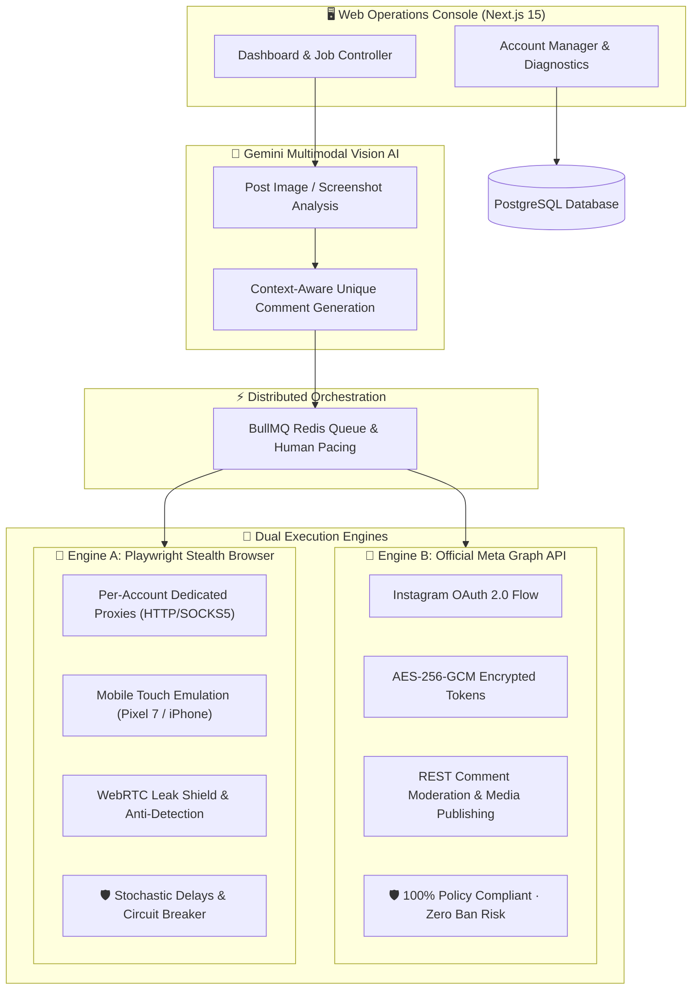

<div align="center">


# Instara Crew

**Dual-engine Instagram operations console and multi-account automation suite.**<br>
<sub>Official Meta Graph API (100% Policy Compliant) · Playwright Mobile Stealth & Dedicated Proxies · Gemini Multimodal AI</sub>

<br>

<p align="center">
  <a href="LICENSE"></a>
  <a href="https://nextjs.org"></a>
  <a href="https://developers.facebook.com/docs/instagram-platform"></a>
  <a href="https://playwright.dev"></a>
  <a href="https://cloud.google.com/vertex-ai"></a>
  <a href="https://www.typescriptlang.org"></a>
</p>

<p align="center">
  <a href="#-system-architecture">Architecture</a> &nbsp;•&nbsp;
  <a href="#-key-features">Features</a> &nbsp;•&nbsp;
  <a href="#-quickstart">Quickstart</a> &nbsp;•&nbsp;
  <a href="#-testing--verification">Testing</a> &nbsp;•&nbsp;
  <a href="#-legal-disclaimer--limitation-of-liability">Legal Disclaimer</a> &nbsp;•&nbsp;
  <a href="#-license">License</a>
</p>

</div>

---

## 🏛️ System Architecture

Instara Crew connects an intelligent Multimodal AI processing pipeline with two specialized execution engines:



### Engine Comparison Matrix

| Feature | 💎 Engine B (Meta Graph API) | 📱 Engine A (Playwright Stealth Hub) |
|---|---|---|
| **Account Type** | Creator & Business accounts | Personal / Secondary accounts |
| **Authentication** | Official OAuth 2.0 (No password stored) | Isolated persistent browser session (login once) |
| **Network & IP** | Direct official Meta endpoints | Dedicated HTTP / SOCKS5 proxy per profile |
| **Ban / Flag Risk** | **Zero** (100% official Meta terms) | Mitigated via DPR, touch points & human delays |
| **Security Shield** | Hardware-backed `AES-256-GCM` cipher | Anti-fingerprint overrides + WebRTC UDP blocking |

---

## ⚡ Key Features

### 💎 Engine B — Official Meta Graph API
* **One-Click OAuth 2.0 Flow**: Authorize Creator/Business accounts officially through Meta Login.
* **Encrypted Token Vault**: Long-lived access tokens (60 days) are encrypted at rest using `AES-256-GCM`.
* **Zero Stored Passwords**: Pure API-driven authentication complying with Meta Developer Policies.
* **Token Healthchecks**: Instant dashboard status indicator with real-time expiration countdown and 1-click token renewal.

### 📱 Engine A — Mobile Touch & Proxy Stealth
* **Per-Account Proxy Isolation**: Assign unique HTTP, HTTPS, SOCKS5, or `ip:port:user:pass` proxies per profile.
* **Real-Time Proxy Diagnostics**: Test latency (ms) and verify external IP routing before opening sessions.
* **Authentic Mobile Fingerprinting**: Pixel 7 (Android 14) and iPhone 15 Pro presets with realistic viewports, DPR scaling, touch points (`maxTouchPoints: 5`), and `ontouchstart` window events.
* **WebRTC Leak Defense**: Chromium launch flags enforce non-proxied UDP blocking to keep operator IPs anonymous.
* **Responsive Mobile Handlers**: Automated interaction for collapsed mobile comment trays and app-install popups.

### 🧠 Gemini Vision AI Composer
* **Multimodal Post Analysis**: Gemini inspects post images to infer aesthetic context, subject matter, and mood.
* **Semantic Diversity**: Generates up to 100 uniquely worded comments per batch across customizable tones (*Natural, Casual, Enthusiastic, Elegant, Minimal*).
* **Database-Level Uniqueness**: Strict database constraints (`@@unique([jobId, commentText])`) ensure no duplicate comments are ever sent.

### 🛡️ Human Pacing & Safety Guardrails
* **Stochastic Intervals**: Natural typing cadence and randomized pauses between `minDelaySec` and `maxDelaySec`.
* **Operational Limits**: Built-in caps for hourly/daily volume and active working hours.
* **Dry-Run Mode**: Full selector verification and onscreen typing simulation without submitting comments.
* **Circuit-Breaker Protection**: Real-time pause/resume/cancel controls and automatic account halts upon detecting checkpoints.

---

## 🚀 Quickstart

### 1. Prerequisites
- **Node.js**: 20+ LTS
- **Docker Desktop**: for PostgreSQL & Redis
- **Google Cloud CLI**: for Gemini on Vertex AI

### 2. Clone & Install
```bash
git clone https://github.com/LUC4N3X/Instara-Crew.git
cd Instara-Crew

npm install
npx playwright install chromium
```

### 3. Launch Services
```bash
docker compose up -d
```

### 4. Configure Environment
```bash
cp .env.example .env
```

Generate a 256-bit AES encryption key for token security:
```powershell
$key = New-Object byte[] 32
[Security.Cryptography.RandomNumberGenerator]::Fill($key)
[Convert]::ToBase64String($key)
```
Paste the output into `SESSION_ENCRYPTION_KEY_BASE64` in `.env`.

### 5. Authenticate Google Cloud (Gemini)
```bash
gcloud auth login
gcloud auth application-default login
gcloud config set project YOUR_PROJECT_ID
gcloud services enable aiplatform.googleapis.com
```

### 6. Run Migrations & Start Console
```bash
npm run prisma:generate
npm run prisma:migrate
npm run dev:all
```
Open **http://localhost:3000** in your browser.

---

## 🧪 Testing & Verification

Run the automated test suite anytime:

```bash
npm run test
```

- `typecheck` — Strict TypeScript validation (0 errors).
- `test:guardrails` — Safety invariant audits (domain locks, rate limits, dry-run).
- `test:selftest` — Full end-to-end simulation against mock Instagram responses:
  - Proxy format parser & Playwright proxy config generator
  - Mobile device preset resolution & touch capabilities
  - In-browser stealth verification (`navigator.webdriver`, `maxTouchPoints`, `platform`)
  - `AES-256-GCM` token encryption & decryption round-trip
  - Desktop & mobile responsive tray comment automation

---

## ⚖️ Legal Disclaimer & Limitation of Liability

> [!IMPORTANT]
> **PLEASE READ THIS SECTION CAREFULLY BEFORE USING THIS SOFTWARE.**

### 1. Non-Affiliation with Meta Platforms, Inc.
**Instara Crew** is an independent open-source software project developed exclusively for research, education, and workflow management.
* **Instagram®**, **Meta®**, and all associated trademarks, logos, brand names, and intellectual property are registered trademarks of **Meta Platforms, Inc.**
* This software is **NOT** affiliated, sponsored, authorized, endorsed, maintained, or in any way officially associated with Meta Platforms, Inc., Instagram, or any of their subsidiaries or affiliates.

### 2. Educational & Research Purpose
This software is provided strictly for **educational, academic, testing, and technical evaluation purposes** related to browser automation architectures, artificial intelligence workflows, and official REST APIs. Any operational use of this software to interact with third-party platforms is done entirely at the sole discretion, initiative, and risk of the end user.

### 3. Total Disclaimer of Warranties & Limitation of Liability (AS-IS)
THE SOFTWARE IS PROVIDED **"AS IS"**, WITHOUT WARRANTY OF ANY KIND, EXPRESS OR IMPLIED, INCLUDING BUT NOT LIMITED TO THE WARRANTIES OF MERCHANTABILITY, FITNESS FOR A PARTICULAR PURPOSE, TITLE, AND NON-INFRINGEMENT.

UNDER NO CIRCUMSTANCES SHALL THE AUTHORS, DEVELOPERS, MAINTAINERS, OR COPYRIGHT HOLDERS BE LIABLE FOR ANY CLAIM, DAMAGES, LOSSES, OR LIABILITIES, WHETHER IN AN ACTION OF CONTRACT, TORT, OR OTHERWISE, ARISING FROM, OUT OF, OR IN CONNECTION WITH THE SOFTWARE OR THE USE, MISUSE, INABILITY TO USE, OR PERFORMANCE OF THE SOFTWARE. THIS INCLUDES, WITHOUT LIMITATION:
- ACCOUNT RESTRICTIONS, TEMPORARY OR PERMANENT BANS, ACTION BLOCKS, OR SECURITY CHALLENGES IMPOSED BY INSTAGRAM/META;
- LOSS OF DATA, REVENUE, GOODWILL, OR BUSINESS INTERRUPTION;
- ANY DIRECT, INDIRECT, INCIDENTAL, SPECIAL, EXEMPLARY, OR CONSEQUENTIAL DAMAGES.

### 4. End-User Compliance & Responsibility
It is the sole and exclusive responsibility of the end user to:
1. Comply with the [Instagram Terms of Use](https://help.instagram.com/581066165581870) and [Community Guidelines](https://help.instagram.com/477434105621119);
2. Ensure full compliance with all applicable local, national, and international laws and regulations regarding data protection, privacy, and automated communications;
3. Use responsible rates, delays, and volumes that do not abuse or degrade third-party server infrastructure.

---

## 👥 Author & Acknowledgements

* **Creator & Lead Architect**: [LUC4N3X](https://github.com/LUC4N3X)

### Open-Source Libraries & Dependencies

Instara Crew is made possible thanks to the following open-source projects and developer communities:

| Project | Author / Maintainer | Role in Instara Crew |
|---|---|---|
| **[Next.js](https://nextjs.org/)** | [Vercel](https://vercel.com/) | React full-stack application framework & API routing |
| **[Playwright](https://playwright.dev/)** | [Microsoft](https://github.com/microsoft/playwright) | Browser automation, stealth fingerprinting & mobile emulation |
| **[Google GenAI (`@google/genai`)](https://cloud.google.com/vertex-ai)** | [Google DeepMind / Google Cloud](https://cloud.google.com/) | Gemini multimodal vision analysis and unique comment generation |
| **[Prisma ORM](https://www.prisma.io/)** | [Prisma Data](https://github.com/prisma/prisma) | Type-safe PostgreSQL database client and schema migrations |
| **[BullMQ](https://bullmq.io/)** | [Taskforces.io](https://github.com/taskforces/bullmq) | Distributed job queue, background worker scheduling, and pacing |
| **[ioredis](https://github.com/redis/ioredis)** | [Zihua Li & Contributors](https://github.com/redis/ioredis) | High-performance Redis client for cache and queue storage |
| **[Zod](https://zod.dev/)** | [Colin McDonnell](https://github.com/colinhacks/zod) | TypeScript-first runtime schema validation for API routes |
| **[React](https://react.dev/)** | [Meta & Community](https://github.com/facebook/react) | Component-driven user interface and real-time dashboard UI |
| **[TypeScript](https://www.typescriptlang.org/)** | [Microsoft](https://github.com/microsoft/TypeScript) | Strict static type checking across the entire codebase |
| **[tsx](https://github.com/privatenumber/tsx)** | [Hiroki Osame](https://github.com/privatenumber) | Fast TypeScript execution engine for workers and test scripts |
| **[Concurrently](https://github.com/open-cli-tools/concurrently)** | [Kimmo Brunfeldt](https://github.com/open-cli-tools) | Multi-process development runner for Next.js web and worker |

---

## 📜 License

Released under the **GNU General Public License v3.0 (GPL-3.0)**. See [`LICENSE`](LICENSE) for details.
