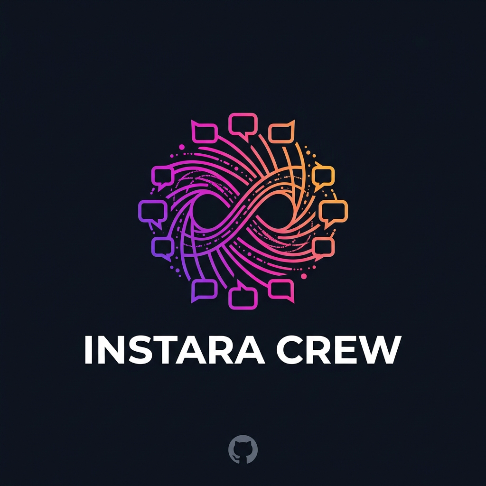

<div align="center">



<br />

# Instara Crew

> [!WARNING]
> 🚧 **ACTIVE DEVELOPMENT — EXPERIMENTAL SOFTWARE**  
> Instara Crew is currently under active development. Features, integrations and runtime behavior may change or break without notice. **Do not treat the current version as production-ready.**

### A self-hosted control center for managing Instagram workflows across multiple authorized accounts, with AI-assisted content preparation and operator-controlled execution.

</div>

---

## 🎛️ What Instara Crew Does

**Instara Crew brings multi-account Instagram workflow management into one dashboard.**

Instead of handling accounts, content preparation and job status separately, the project keeps the complete workflow in one self-hosted workspace.

With Instara Crew you can:

- manage multiple authorized Instagram accounts from one place;
- use Gemini to prepare context-aware comment candidates from supplied content and instructions;
- control tone, quantity and additional context for each job;
- organize generated items and assign work across available accounts;
- run work as tracked background jobs;
- verify browser-based workflows with **Dry Run** before final submission;
- pause or cancel jobs when needed;
- follow progress, errors and item status from the dashboard;
- use the official Meta integration for supported account types and operations;
- keep supported browser-based account sessions separated from one another.

> **One workspace. Multiple accounts. Clear control over every job.**

---

## 🧵 How It Works

### 1. Add your accounts

Add the accounts you are authorized to manage. Instara Crew keeps account state separated so each profile can be handled independently.

Supported Creator / Business workflows can use the official Meta integration where available, while other supported workflows can operate through a persistent browser session.

### 2. Create a job

Choose the target content and define what you want to prepare: quantity, tone and any additional context that should guide the result.

### 3. Prepare the content with Gemini

Gemini can analyze the supplied visual or contextual information and prepare multiple candidate comments for the job.

Each generated item is stored individually so the batch can be reviewed and tracked cleanly.

### 4. Run and monitor the job

Instara Crew processes prepared items as background work and keeps their state visible from the dashboard.

You can follow what is ready, running, completed, skipped or failed and use pause/cancel controls when necessary.

---

## 🧰 Main Features

### Multi-account workspace

Keep several profiles in the same dashboard without collapsing everything into one shared account state.

### AI-assisted preparation

Generate multiple context-aware candidate comments using Gemini, with configurable tone and additional instructions.

### Official Meta integration

For eligible accounts and supported actions, Instara Crew includes a dedicated Meta Graph API path using the permissions granted through Meta.

### Persistent browser sessions

Supported browser-based workflows can reuse separated local account sessions rather than starting from a blank browser every time.

### Dry Run by default

Dry Run is designed to let the operator verify a browser workflow before allowing the final external action.

### Background jobs

Preparation and execution are processed as tracked jobs so progress is not tied to a single page request.

### Visible status and errors

Individual job items keep their own state and error information, making it easier to understand what actually happened during a run.

### Operator controls

Instara Crew includes configurable execution limits and pause/cancel controls intended to reduce accidental over-execution. These controls **do not guarantee platform acceptance or account safety**.

---

## 🛠️ Quick Start

Requirements: **Node.js 20+**, **npm**, **Docker + Compose** and **Google Cloud CLI** if using Gemini through Vertex AI.

```bash
git clone https://github.com/LUC4N3X/Instara-Crew.git
cd Instara-Crew
npm install
npx playwright install chromium
docker compose up -d
```

Copy the environment template:

```bash
cp .env.example .env
```

On Windows PowerShell:

```powershell
Copy-Item .env.example .env
```

Configure the values you actually need in `.env`, then prepare the database and start the project:

```bash
npm run prisma:generate
npm run prisma:migrate
npm run dev:all
```

Open **http://localhost:3000**.

> [!CAUTION]
> Never commit your real `.env`, credentials, OAuth material, browser-session data or encryption keys.

---

## Configuration

Configuration is centralized in [`.env.example`](.env.example).

It covers the database and queue services, session encryption, optional Meta integration, Gemini / Google Cloud settings, browser-session configuration and execution controls. Copy it to `.env` and change only the values required for your setup.

---

## Development Status

**Instara Crew is experimental and under active development.**

The project is currently in its early `0.1.x` development line. Features, integrations and workflow behavior may change significantly while the project is refined.

Current development is focused on making account management, content preparation, job execution and operator visibility more reliable and polished.

---

## Legal & Responsible Use

> [!IMPORTANT]
> **Please read this section before using the software.** Instara Crew is an independent open-source project that can interact with third-party platforms and services outside the control of its author and contributors.

### No affiliation or endorsement

**Instara Crew is not affiliated with, endorsed by, sponsored by, approved by, maintained by or officially connected with Meta Platforms, Inc., Instagram, Google, Google Cloud, Microsoft or any other third-party platform or service referenced by the project.**

Instagram®, Meta® and other third-party names, trademarks and logos remain the property of their respective owners. References in this repository are made solely for identification, interoperability and descriptive purposes.

### User responsibility

Each user is solely responsible for how the software is configured, deployed and used and for determining whether a particular use is lawful and permitted.

Users are responsible for complying with applicable laws, platform terms, developer policies and technical restrictions; using only accounts, credentials, systems, content and data they own or are expressly authorized to access; obtaining required permissions or consents; protecting credentials and personal data; and reviewing generated content and automated actions before use where appropriate.

**The presence of a capability in this repository does not mean that a third-party platform permits that capability or that it is lawful or suitable for every use case.**

### Platform and account risk

Third-party platforms can change APIs, interfaces, authentication, policies, limits and enforcement practices at any time.

The author and contributors do not guarantee continued compatibility, acceptance of any action, uninterrupted service or freedom from account warnings, restrictions, suspensions or termination.

Use of the software and interaction with third-party platforms are undertaken **at the user's own risk**.

### AI-generated content

AI-assisted output may be incomplete, inaccurate, repetitive, inappropriate or unsuitable for a particular context. The user remains responsible for reviewing and deciding whether generated output should be used.

### Third-party services

Availability, pricing, policies, data handling, behavior and security of external services are outside the control of this project. The author and contributors are not responsible for outages, policy changes, account actions, billing or other consequences attributable to third-party products or services.

### No warranty

**TO THE FULLEST EXTENT PERMITTED BY APPLICABLE LAW, THE SOFTWARE IS PROVIDED “AS IS” AND “AS AVAILABLE”, WITHOUT WARRANTY OF ANY KIND, EXPRESS OR IMPLIED.**

### Limitation of liability

**TO THE FULLEST EXTENT PERMITTED BY APPLICABLE LAW, THE AUTHOR, COPYRIGHT HOLDERS AND CONTRIBUTORS SHALL NOT BE LIABLE FOR DIRECT, INDIRECT, INCIDENTAL, SPECIAL, EXEMPLARY, PUNITIVE OR CONSEQUENTIAL LOSS OR DAMAGE ARISING FROM OR RELATED TO THE SOFTWARE OR ITS USE, MISUSE OR INABILITY TO USE.**

Nothing in this notice excludes or limits liability where such exclusion or limitation is prohibited by applicable law.

Instara Crew is distributed under the **GNU General Public License v3.0 or later**. The complete terms are contained in [`LICENSE`](LICENSE). If anything in this README conflicts with the license, **the license text controls**.

### Not legal advice

This documentation provides general project information only and does not constitute legal advice. Laws and contractual obligations vary by jurisdiction and use case.

---

## Author

Created and maintained by **[LUC4N3X](https://github.com/LUC4N3X)**.

If Instara Crew is useful to you, consider starring the repository.

<div align="center">

<br />

**Instara Crew** · One workspace. Multiple accounts. Full control.

</div>